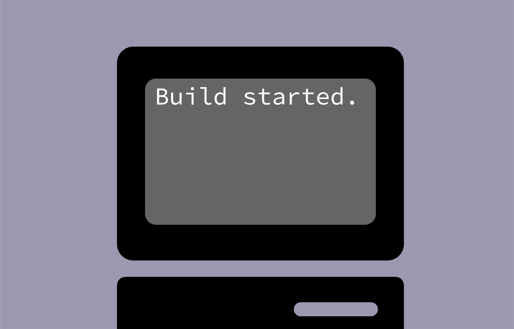

# The PsBuilder Logo
</img>
Our logo is the contents of a Microsoft Windows folder being took to a CD. You may download it subject to the conditions.

## Rights
You have the rights to do the following with the logo:
* link to us
* describe PsBuilder
* state your app is built using PsBuilder

However, you may need to ask permission to publicly use it outside the web, like:
* Videos
* Images

Even with PsBuilder's permission, you are not allowed to use our logo to link to a site not hosted by PsBuider,
create mimicking sites, or otherwise misleading others.

# The PsBuilder Banner
</img>
This banner is a demonstration of how PsBuilder runs. It will display once you find PsBuilder outside of Search or the user page.
We release it under the [PsBuilder license](#rights).
